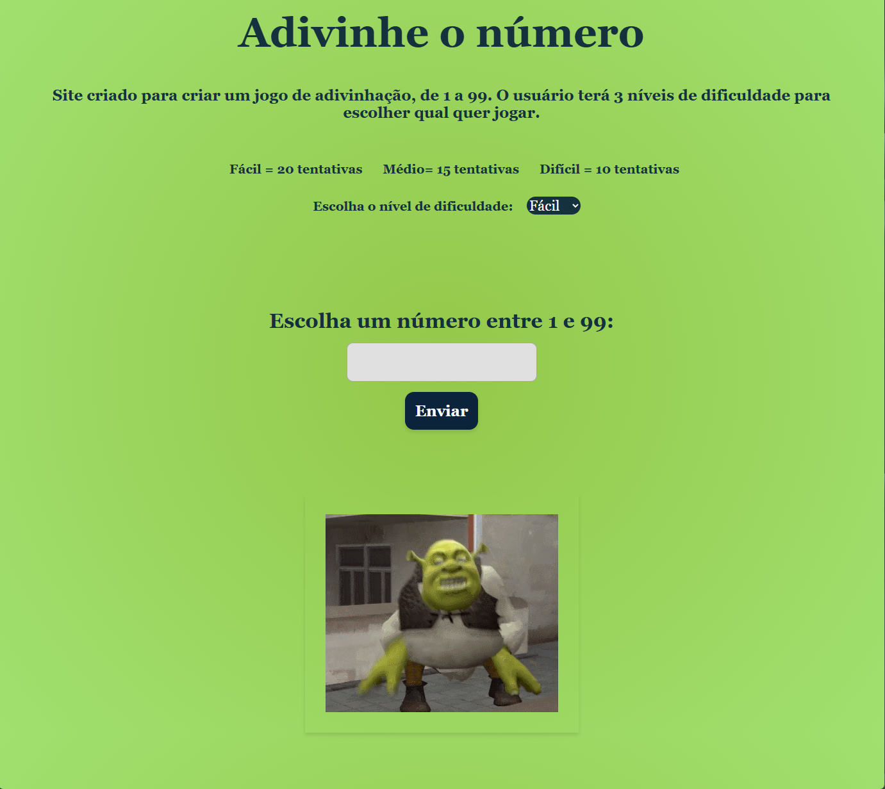

# Shrek-Sure-Guess

Bem-vindo ao **Shrek-Sure-Guess**, o Jogo da Adivinhação! O objetivo é simples: adivinhe um número aleatório entre 1 e 99. Mas há um detalhe importante: o jogo vem com três níveis de dificuldade para desafiar você! Escolha entre o nível fácil (1-20), médio (1-50) ou difícil (1-99) e comece a jogar.

## Como Jogar

1. **Escolha o Nível de Dificuldade**: O jogo oferece três opções de dificuldade, para você escolher conforme o seu nível de confiança!
2. **Faça Seu Palpite**: Digite um número entre 1 e o máximo escolhido para o seu nível e clique no botão "Chutar!".
3. **Receba o Feedback**: O jogo vai te informar se o número está maior ou menor que o número secreto. Continue tentando até acertar!
4. **Shrek Dançando**: Quando você acertar o número, o Shrek vai começar a dançar para comemorar a sua vitória!

O jogo se torna mais emocionante à medida que você avança nos níveis de dificuldade. E, claro, o Shrek sempre estará lá para celebrar cada vitória com sua dança divertida quando você finalmente acertar o número.

Prepare-se para testar seus instintos e boa sorte!

## Tecnologias Usadas

- **HTML5**
- **CSS3**
- **JavaScript (ES6+)**
